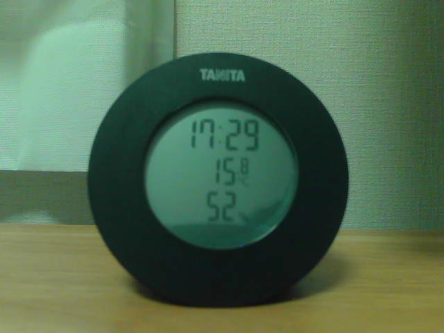
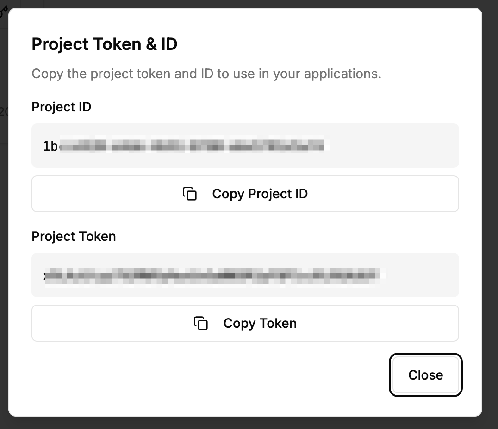
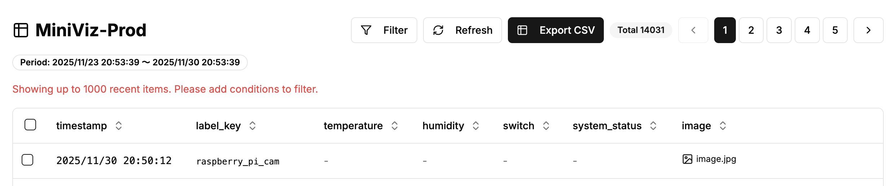
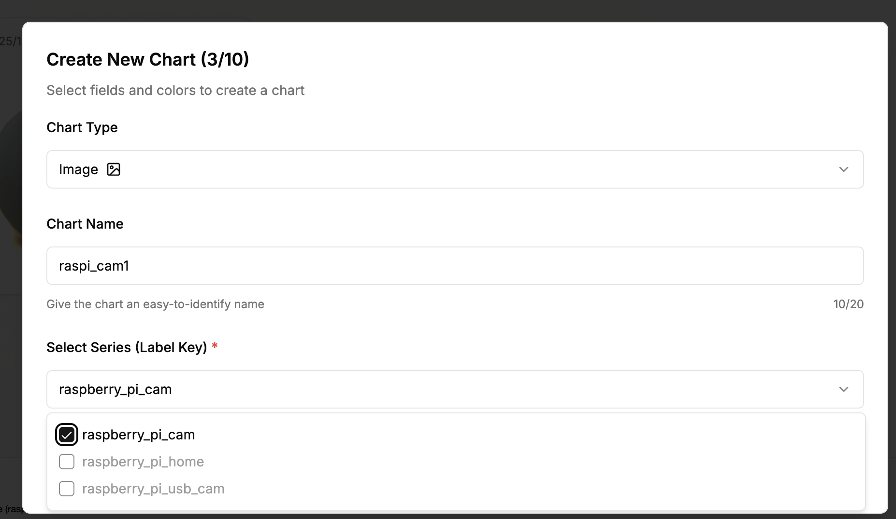
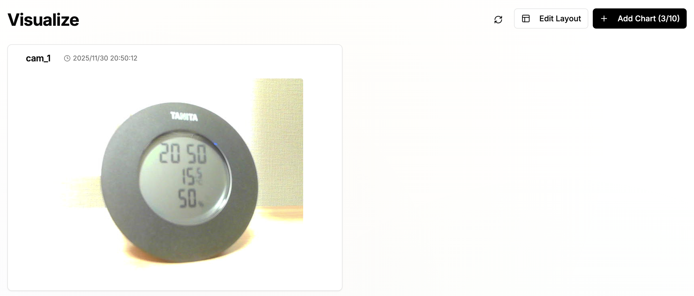

# Raspberry Pi and USB Camera Image Transmission Sample

## What We'll Do
Connect a USB camera to Raspberry Pi and send images to Miniviz.
※Image transmission feature is only available for Pro plan. Not available for free plan.

## Required Items and Environment
* Raspberry Pi
* USB Camera
* Miniviz Project ID and Token

# Connect Raspberry Pi and USB Camera

Connect the USB camera and run the lsusb command.
```
pi@raspberrypi:~ $ lsusb
Bus 001 Device 001: ID 1d6b:0002 Linux Foundation 2.0 root hub
Bus 001 Device 002: ID 0424:2514 Microchip Technology, Inc. (formerly SMSC) USB 2.0 Hub
Bus 001 Device 003: ID 0424:2514 Microchip Technology, Inc. (formerly SMSC) USB 2.0 Hub
Bus 001 Device 004: ID 0424:7800 Microchip Technology, Inc. (formerly SMSC)
Bus 001 Device 007: ID 0411:02da BUFFALO INC. (formerly MelCo., Inc.) USB 2.0 Camera // This is the USB camera
```

You can check the USB camera device file.
```
$ ls /dev/video*
/dev/video0  /dev/video10  /dev/video12  /dev/video14  /dev/video16  /dev/video20  /dev/video22  /dev/video31
/dev/video1  /dev/video11  /dev/video13  /dev/video15  /dev/video18  /dev/video21  /dev/video23
```

## Check Camera Video

```
$ sudo apt-get install fswebcam
$ fswebcam -r 640x480 --no-banner image.jpg
```

Check the image
(The quality is not great, but it's captured.)



# Send Camera Images to Miniviz

1. Get Project ID and Token
2. Call the image transmission API and send a sample image
3. If there are no issues, call the camera image transmission API to send camera images

## 1. Get Project ID and Token

Get the Project ID and Token.

Create Project -> Get Project ID and Token

<!-- Account -->


## 2. Call Image Transmission API and Send Sample Image

API: Send image in request body
```
POST https://api.miniviz.net/api/project/{project_id}/image?token={token}
```

Request Body
```
{
    "timestamp": 1717587812345,
    "label_key": "raspberry_pi_home",
    "image_name": "camera_001.jpg",
    "image_base64": "base64_encoded_image_data"
}
```

### Send Sample Image (Python)

```python
#!/usr/bin/env python3
"""
Send image to miniviz
"""
import requests
import base64
import os
from datetime import datetime, timezone

# Configuration
PROJECT_ID = "PROJECT_ID"
TOKEN = "TOKEN"
API_URL = "https://api.miniviz.net"
IMAGE_PATH = "image.jpg"
LABEL_KEY = "raspberry_pi_cam"

# Encode image to base64
with open(IMAGE_PATH, "rb") as f:
    image_data = f.read()
image_base64 = base64.b64encode(image_data).decode('utf-8')

# Send request
url = f"{API_URL}/api/project/{PROJECT_ID}/image"
payload = {
    "timestamp": int(datetime.now(timezone.utc).timestamp() * 1000),
    "label_key": LABEL_KEY,
    "image_name": os.path.basename(IMAGE_PATH),
    "image_base64": image_base64
}

try:
    response = requests.post(url, json=payload, params={"token": TOKEN})
    response.raise_for_status()
    print("✅ Send successful")
    print(response.json())
except requests.exceptions.HTTPError as e:
    print(f"❌ Error: HTTP {e.response.status_code}")
    print(e.response.text)
except Exception as e:
    print(f"❌ Error: {e}")
```


## 3. Send Camera Images

If the sample code works, send camera images.

### Sample Code
See the code here.
[Sample Code](../samplecode/raspi_cam_ex1)

### Display Images in Database

Check data from the Database menu.
Sent data is saved in the database.
※If data is not displayed here, data transmission has failed. Please check the device-side logs again.※




### Display Images in Visualize

Create graphs from the Visualize menu.
You can configure graph types and data display formats.






