# Miniviz Docs

Miniviz はIoTシステム向けのBIプラットフォームです。

# クイックスタート

## 全体の流れ

1. [Miniviz新規登録](#1-minivizアカウント作成ログイン)
2. [プロジェクト作成](#2-プロジェクト作成)
3. [(デバイス側)データ送信](#3-デバイス側データ送信)
4. [データの確認(データベース)](#4-データの確認-データベース)
5. [グラフ作成](#5-グラフ作成)
6. [通知設定](#6-通知設定)

## 1. Minivizアカウント作成/ログイン

メールアドレス・パスワードを入力して新規登録するか、既存のアカウントでログインします。


## 2. プロジェクト作成
データを管理するためのプロジェクトを作成します。

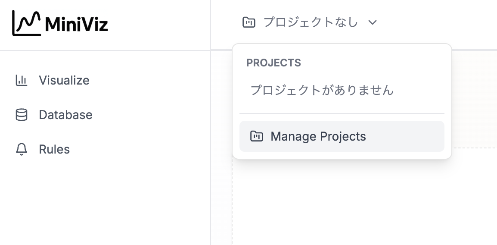

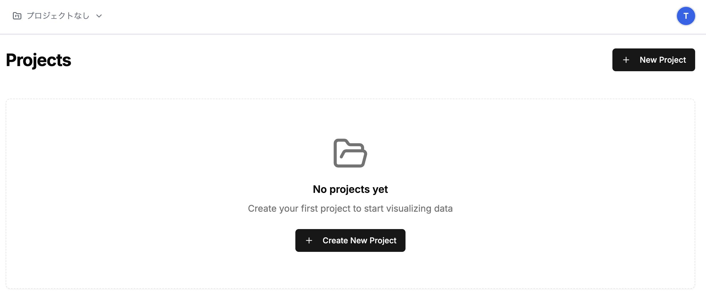
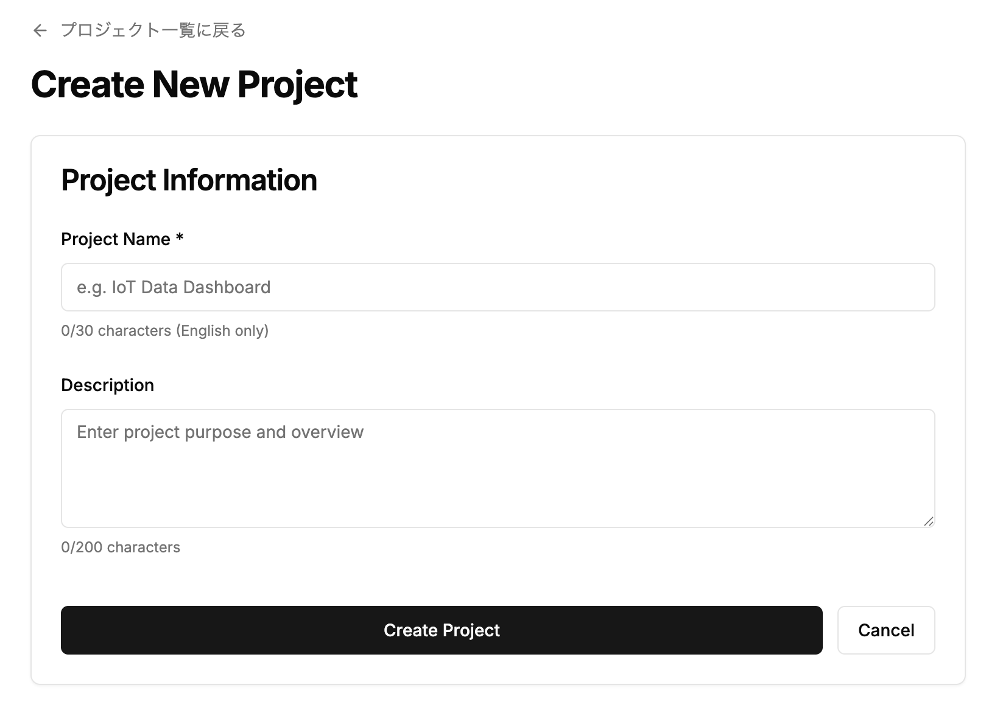


#### プロジェクトID・トークンのコピー
次項で必要になるため、プロジェクトID・トークンをコピーしておきます。
右側のトークンアイコンをクリック
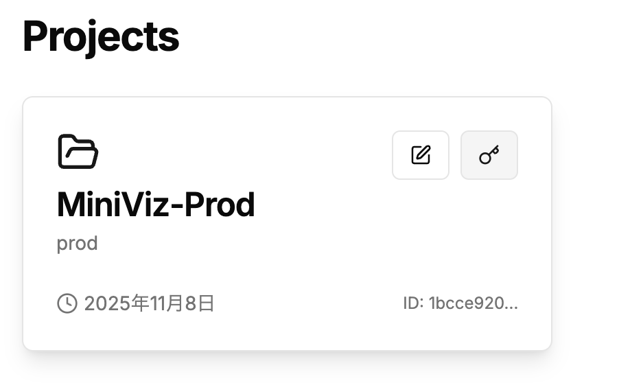

ここでコピーしたトークンは、デバイス側で使用します。
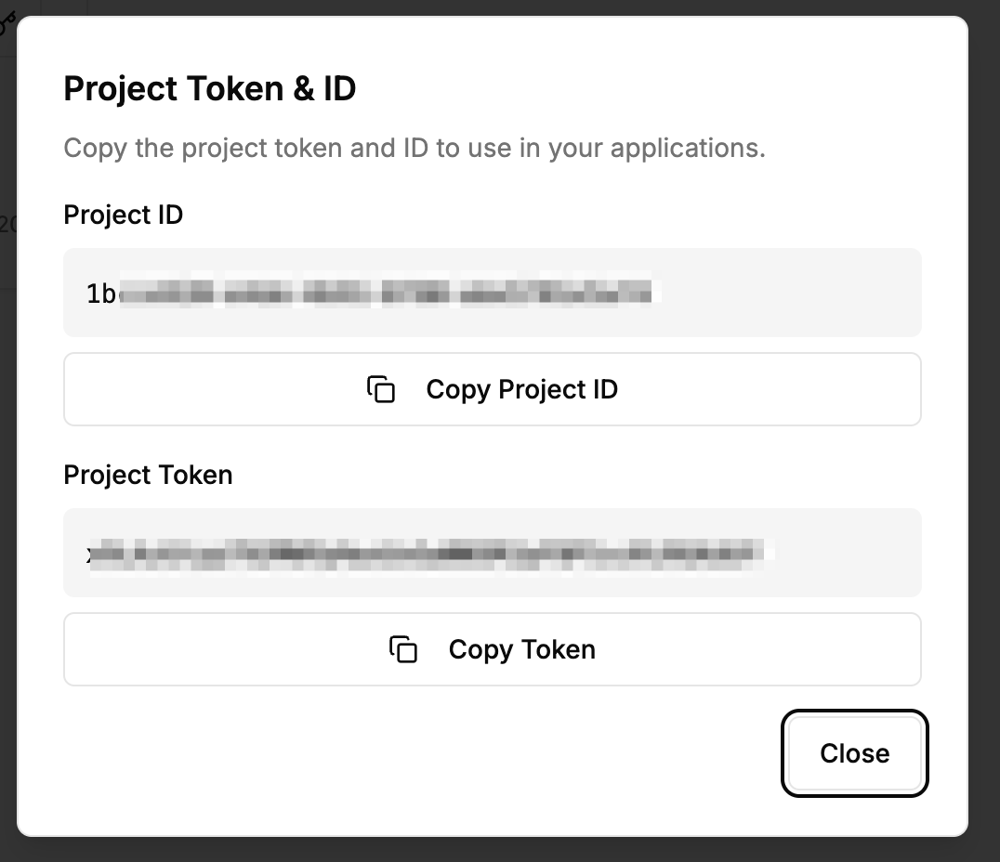


## 3. (デバイス側)データ送信
デバイス側でデータを送信します。
まずはcurlコマンドや簡易のPythonスクリプトでデータ送信できるか確認することをお勧めします。

### APIエンドポイント

```text
POST https://api.miniviz.net/api/project/{project_id}?token={token}
```

### リクエスト概要
Miniviz API へのデータ送信は `POST` メソッドを使用します。送信ボディは JSON 形式です。

### リクエストボディ

| フィールド名 | 型 | 必須 | 説明 |
|--------------|----|------|------|
| `timestamp`  | number | Yes | 送信時刻（UNIX 時間ミリ秒） |
| `label_key`  | string | Yes | デバイス名や設置場所など、送信元を識別するラベル |
| `payload`    | object | Yes | 実際に送信する計測値。キーに任意の指標名、値に数値または文字列を指定 |

- `payload` では数値と文字列をサポートしています。各指標は自由に追加できます。

### リクエスト例

```json
{
  "timestamp": 1731129600000,
  "label_key": "raspberry_pi_home",
  "payload": {
    "temperature": 25,
    "humidity": 55,
    "switch": "true",
    "system_status": "running"
  }
}
```


### curlコマンド(Linux/MacOS)

```bash

timestamp_ms=$(( $(date -u +%s) * 1000 ))

curl -X POST \
  "https://api.miniviz.net/api/project/{project_id}?token={token}" \
  -H "Content-Type: application/json" \
  -d "{
        \"timestamp\": ${timestamp_ms},
        \"label_key\": \"Local_PC\",
        \"payload\": {
          \"temperature\": 25,
          \"humidity\": 55,
          \"switch\": \"true\",
          \"system_status\": \"running\"
        }
      }"
```

### Python

以下のリンクにサンプルコードがあります。
[Pythonサンプル1](./reference/python_ex1.md)

## 4. データの確認(データベース)
Databaseメニューからデータを確認します。
送信されたデータはデータベースに保存されます。
※ここに表示されない場合はデータ送信が失敗しています。再度デバイス側のログなどを確認してください※

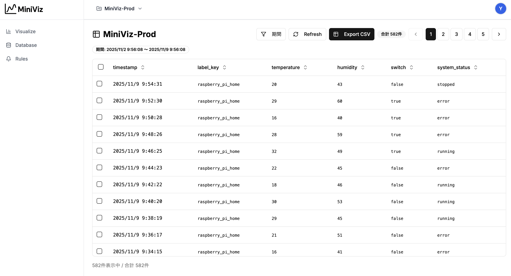


## 5. グラフ作成
Visualizeメニューからグラフを作成します。
グラフを作成します。グラフの種類やデータの表示形式などを設定できます。

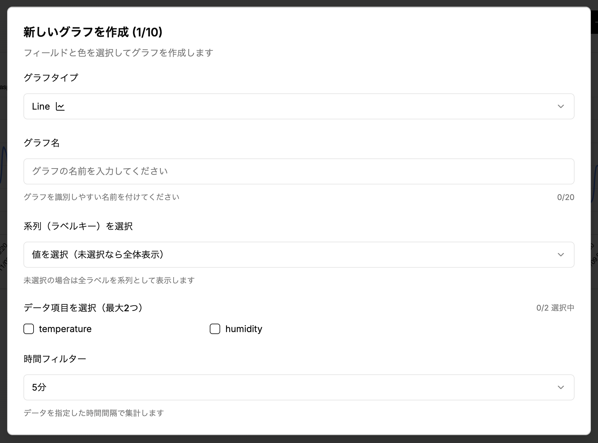

ラインチャート作成後
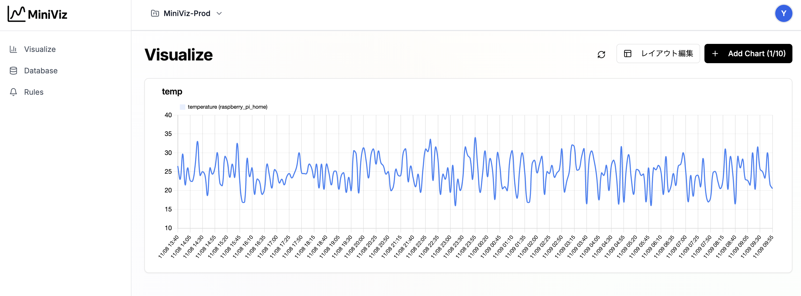

## 6. 通知設定
SlackやWebhookなどの通知先を設定します。
Rulesメニューから通知設定を行います。

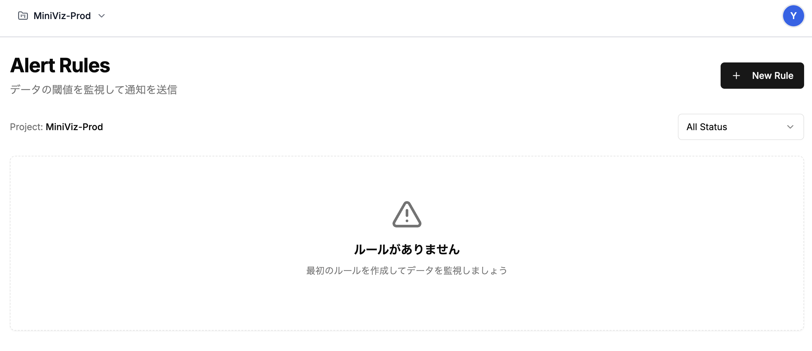

### Slack通知設定
Slack通知設定を行います。
SlackのWebhook URLを入力します。
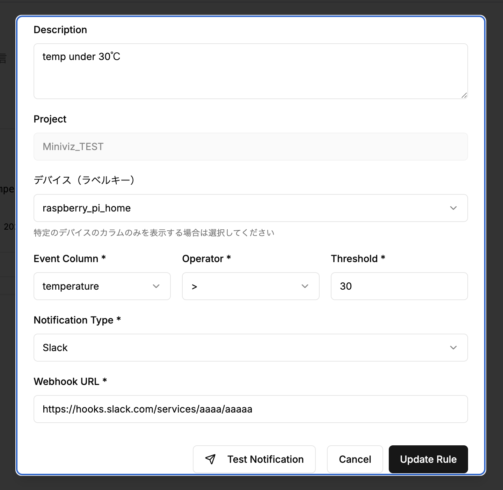

設定した閾値を超えた場合に通知が行われます。
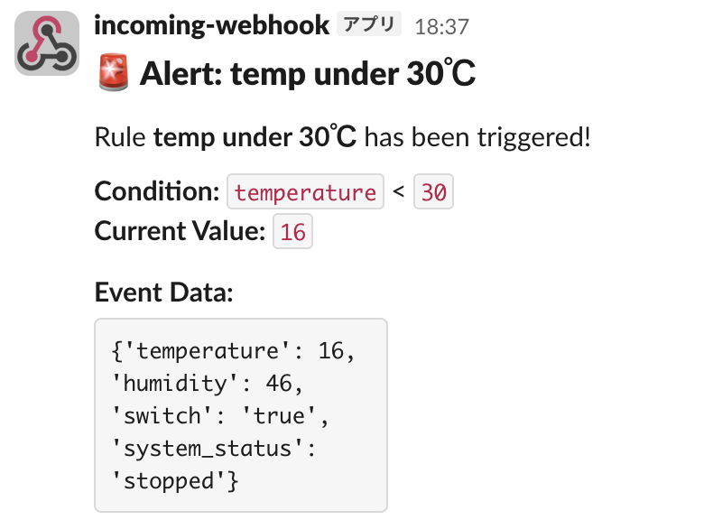
