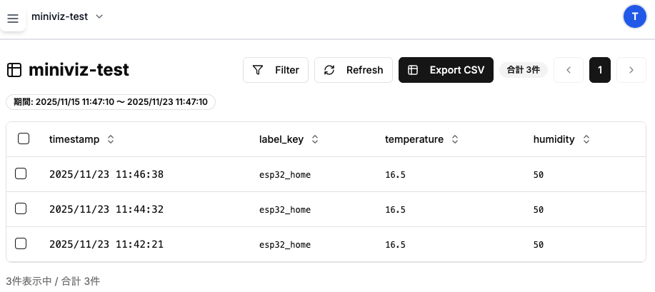

# ESP32を用いたセンサーデータ送信サンプル

## ここで行うこと
* サンプルとして、温度・湿度センサーを用いてデータを送信し、グラフを作成するサンプルを作成します。
簡易的に温度・湿度APIを用いたサンプルコードは[こちら](../samplecode/python_ex1)を参照してください。

## 必要なもの

- ESP32
- USBケーブル（データ転送用）
- 温度・湿度センサー(DHT11など)
- ジャンパーワイヤー
- ブレッドボード（オプション）

## 手順

1. ESP32開発環境のセットアップ（PlatformIO）
2. 温度・湿度センサーを接続/取得
3. データ送信サンプルを実行
4. データ送信確認・グラフ作成
5. (おまけ) OTA更新の設定

## 1. ESP32開発環境のセットアップ（PlatformIO）

PlatformIOを使用してESP32の開発環境をセットアップします。

### PlatformIOのインストール

1. [PlatformIO IDE](https://platformio.org/install/ide?install=vscode)をダウンロード・インストール
   - Visual Studio Code拡張機能としてインストールする方法が推奨されます
2. Visual Studio Codeを起動し、PlatformIO拡張機能が有効になっていることを確認

### プロジェクトの作成

1. PlatformIOのホーム画面から「New Project」を選択
2. プロジェクト名を入力（例：`esp32-miniviz`）
3. Boardとして「ESP32 Dev Module」を選択
4. Frameworkとして「Arduino」を選択
5. プロジェクトを作成
6. (ボーレートは115200に設定してください)

`platformio.ini`ファイルの例
```ini
[env:esp32doit-devkit-v1]
platform = espressif32
board = esp32doit-devkit-v1
framework = arduino
lib_deps = adafruit/DHT sensor library@^1.4.6
monitor_speed = 115200
```

### 必要なライブラリの追加

プロジェクトの`platformio.ini`ファイルに必要なライブラリを追加します。

* [DHT sensor library](https://github.com/adafruit/DHT-sensor-library)

## 2. 温度・湿度センサーを接続/取得

### センサーの接続

DHT11などの温度・湿度センサーをESP32に接続します。

**DHT11の接続例：**

```
DHT11              ESP32
------             ----------------
(1) VCC  --------> 3.3V
(2) DATA --------> GPIO4
(3) NC   --------> -
(4) GND  --------> GND
```


## 3. データ送信サンプルを実行

Miniviz APIにデータを送信するESP32用のコードを作成します。

### コードの作成

`src/main.cpp`ファイルに以下の内容を記述します（`PROJECT_ID`と`TOKEN`は実際の値に置き換えてください）：

-> [ESP32サンプルコード](../samplecode/esp32_ex1)を参照してください。


### ビルドとアップロード

1. ESP32をUSBケーブルでPCに接続
2. PlatformIOのターミナルから以下のコマンドを実行：
3. シリアルモニターで動作を確認：


## 4. データ送信確認・グラフ作成

### データ送信の確認

1. MinivizのWebインターフェースにログイン
2. Databaseメニューから送信されたデータを確認
3. 温度・湿度のデータが表示されていることを確認



### グラフの作成

1. Visualizeメニューからグラフを作成
2. グラフタイプを選択（ラインチャート推奨）
3. データソースとして温度・湿度を選択
4. グラフが正常に表示されることを確認

詳細は[クイックスタート](../quickstart)の「5. グラフ作成」を参照してください。

