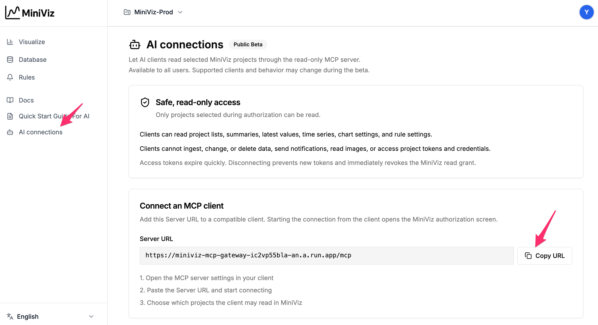
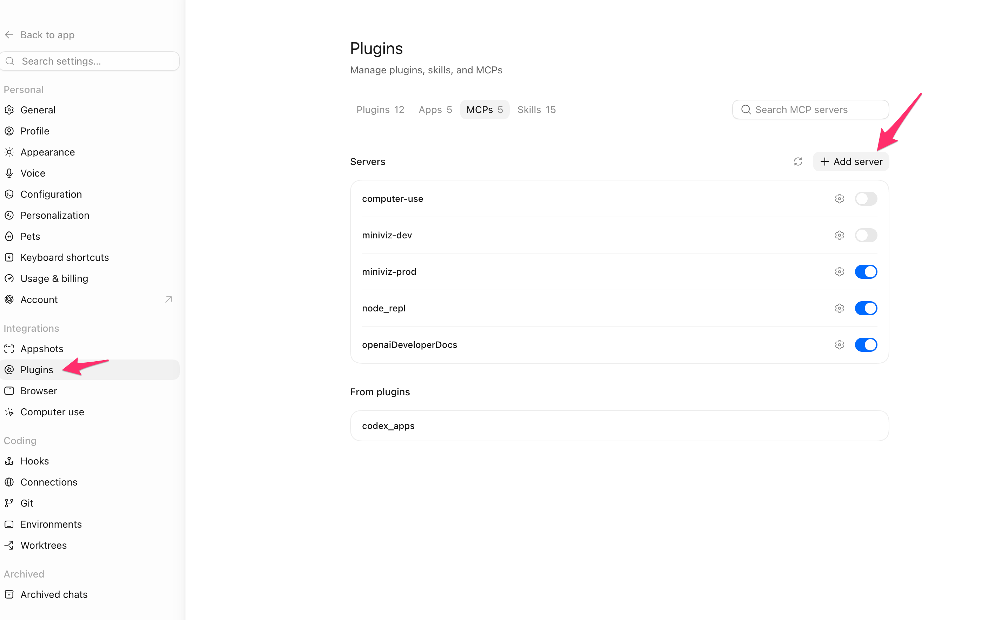
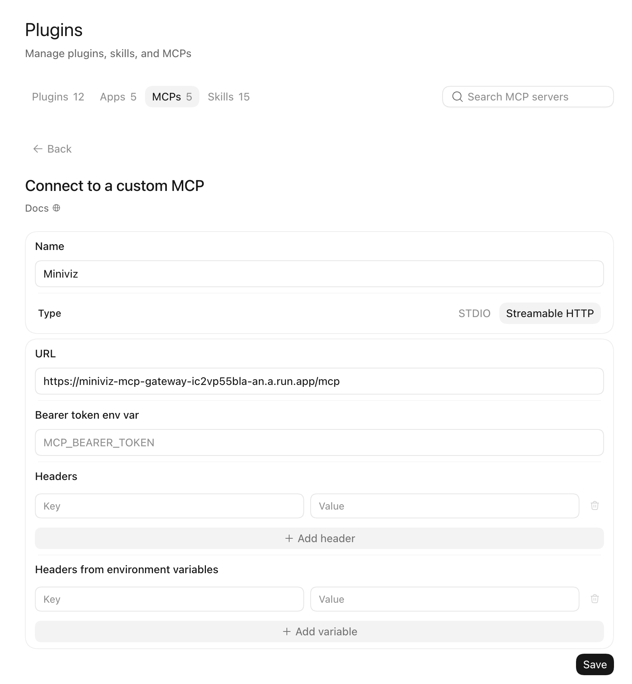
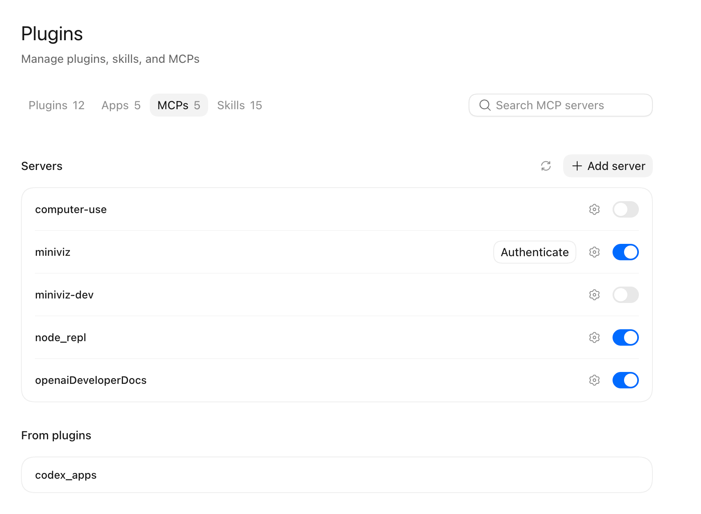
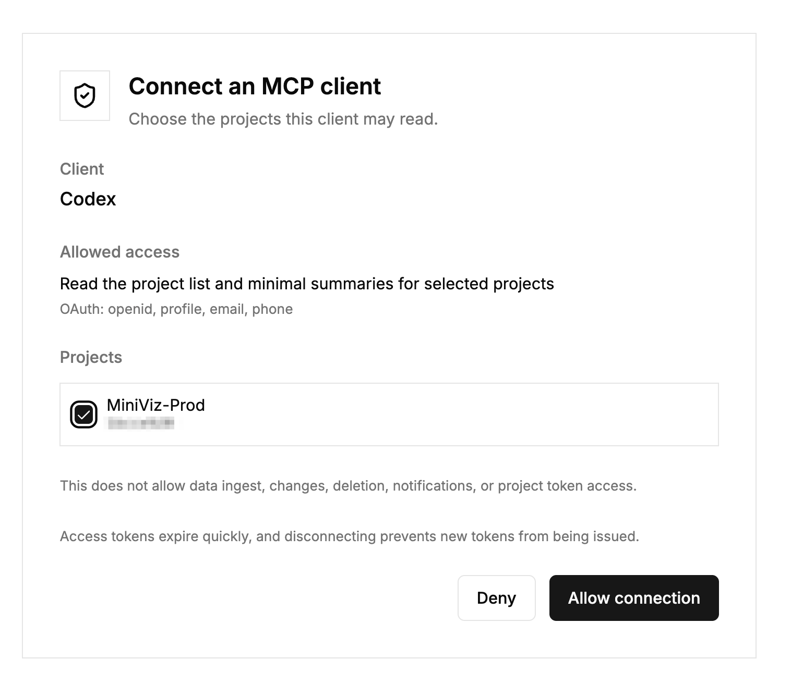
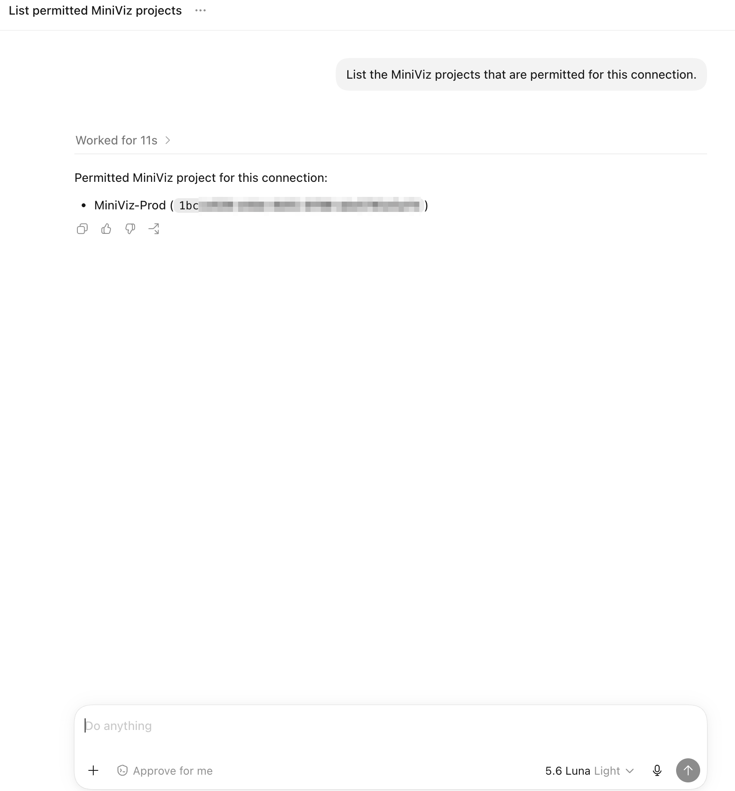
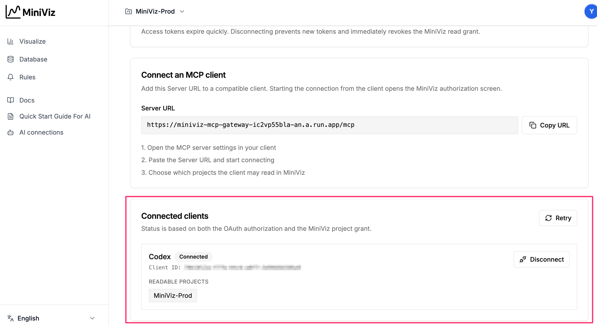

# Connect MiniViz MCP

MiniViz MCP connects a compatible AI client to the MiniViz projects you choose. It lets the AI answer questions about your project data while keeping the connection read-only.

The steps below use Codex as an example client.

## What You Can Do Safely

After connecting, you can use natural language to:

- check latest values;
- analyze trends;
- count matching events;
- understand charts and monitoring rules;
- search official MiniViz Docs.

The AI chooses the appropriate MiniViz tool, so you do not need to know tool names or write a query by hand.

MiniViz MCP never:

- sends, edits, or deletes data;
- changes charts or rules;
- sends notifications;
- returns tokens, credentials, or other secrets.

It can read only the projects selected during authorization.

:::tip Public Beta

MiniViz MCP is currently a Public Beta. Supported clients and details may change while the beta is being improved.

:::

## Connection Flow

1. Copy the Server URL from **AI connections** in MiniViz.
2. Add that URL as a remote MCP server or connector in your AI client.
3. Start the connection and sign in to MiniViz through the authorization screen.
4. Select the projects the client may read and approve the connection.
5. Return to a new chat and confirm that the client can list only those projects.

You can review the connected client, its readable projects, and disconnect it later from **AI connections** in MiniViz.

## Verified Client

MiniViz has been verified with **ChatGPT Developer mode**.

- Authorization: predefined OAuth client
- Verified flow: connection, MiniViz sign-in, project selection, read-only tool discovery, project access, disconnect/revoke

MiniViz has also been verified with **Codex**.

- Verified flow: MCP server registration, OAuth authorization, project selection, permitted-project confirmation, disconnect

Other clients are not listed here as verified. To connect, they must support:

- a remote MCP server over HTTPS;
- OAuth authorization.

Their setup labels and screens may differ from this guide.

## 1. Open AI Connections in MiniViz

1. Sign in to MiniViz.
2. Open **AI connections** from the app navigation.
3. Read the read-only access notice and copy the displayed **Server URL**.

The URL is the only MiniViz connection value you should need to enter in a compatible MCP client. Never copy a token or credential into your client settings.

<div className="mcp-screenshot">



</div>

## 2. Register MiniViz in Your AI Client

1. In Codex settings, open **Plugins** and select the **MCPs** tab.
2. Select **Add server**.

<div className="mcp-screenshot">



</div>

3. Enter a name and choose **Streamable HTTP** as the type.
4. Paste the Server URL copied from MiniViz.
5. Leave Bearer token and Headers empty, then select **Save**.

<div className="mcp-screenshot">



</div>

6. Select **Authenticate** for the newly added MiniViz server to begin authorization.

<div className="mcp-screenshot">



</div>

Other clients use different labels and screens, but follow the same pattern: add a remote MCP server, enter the Server URL, and complete OAuth authorization.

## 3. Sign In and Choose Projects

1. Sign in to MiniViz when asked.
2. On the MiniViz consent screen, select only the projects the client should be able to read.
3. Approve the connection and return to your AI client.

The client can read only the projects selected here. You can reconnect later to change the selection.

<div className="mcp-screenshot">



</div>

## 4. Confirm the Connection

Start a new conversation in Codex and ask:

```text
List the MiniViz projects I authorized for this connection.
```

The client should return only the projects you selected. Once this works, try a question from [MiniViz MCP Tips](./tips).

<div className="mcp-screenshot">



</div>

## Review or Disconnect a Client

Return to **AI connections** in MiniViz to see connected clients and their readable projects. Choose **Disconnect** to revoke the MiniViz permission and OAuth authorization. A disconnected client must complete authorization again before it can read data.

<div className="mcp-screenshot">



</div>

## If Connection Fails

- Confirm that the Server URL was copied from MiniViz without modification.
- Check that your client supports remote MCP servers and OAuth authorization.
- Start with a new chat after completing authorization.
- If the client is listed but cannot read data, disconnect it in MiniViz and connect again.
